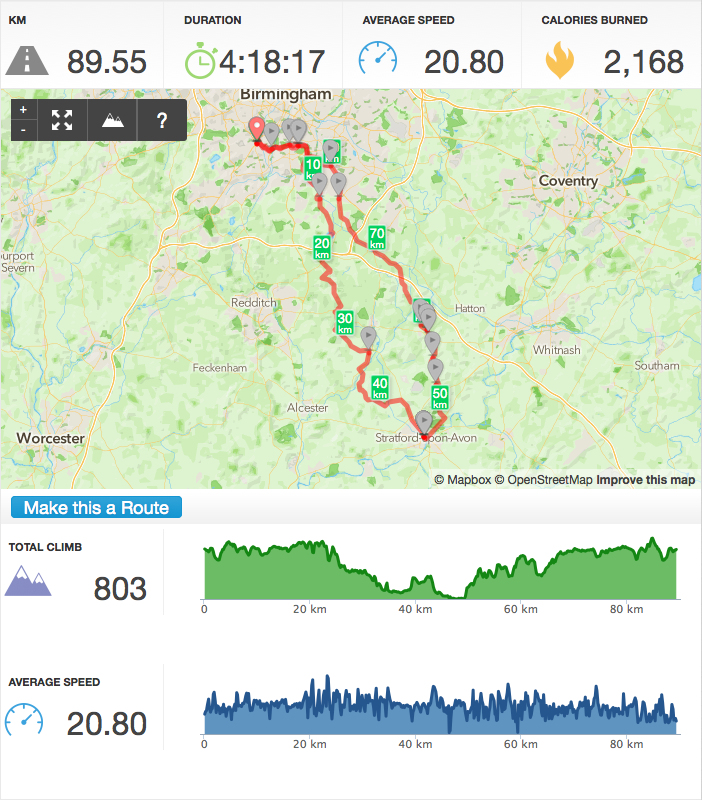
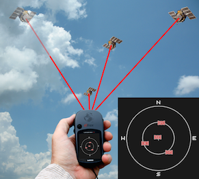
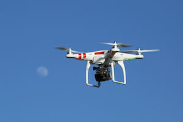
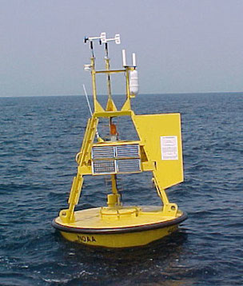
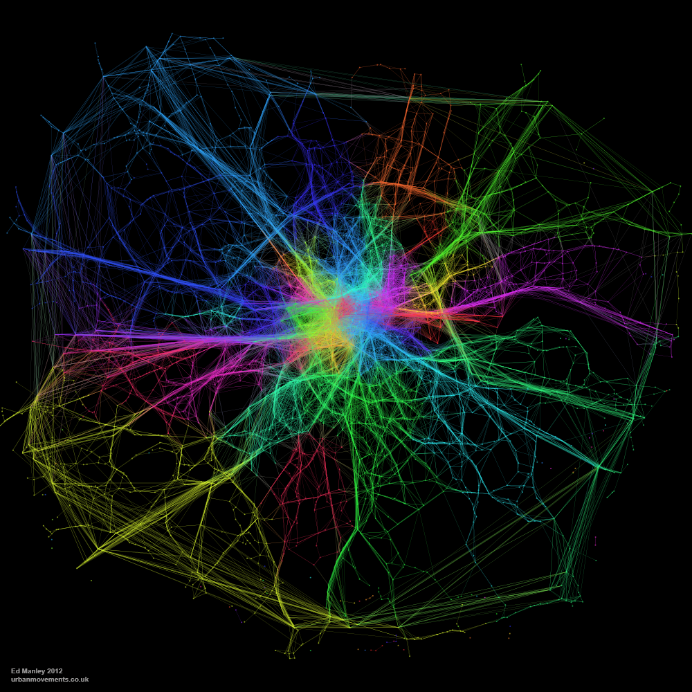

# Definition

## Dictionary

**Source**: [Oxford English Dictionary](http://www.oed.com)

### Quantitative

* "That is, or may be, **measured** or assessed with respect to or on the basis of **quantity**; that may be expressed in terms of quantity; quantifiable."

### Geography

* "The field of study concerned with the **physical features of the earth** and its atmosphere, and with **human activity** as it affects and is affected by these, including the **distribution** of populations and resources and political and economic activities; also as a subject of educational study or examination."

## Academic

### Fotheringham, Brunsdon, and Charlton (2000)
"One or more of the following activities: 

* the analysis of numerical spatial data; 
* the development of spatial theory; 
* and the construction and testing of mathematical models of spatial
  processes"

### Murray (2010)

"The collection of **methods** that are applied, or could/can be applied, by geographers and others to study **spatial** phenomena, issues and problems"

# History

## History

* As practice, origin is very old and hard to date
* As a *movement*, 1950s/60s/70s $\rightarrow$ **Quantitative Revolution**
    * Adoption of the **scientific method** in human geography
    * Focus on **quantification** and measurement
    * Strong association with particular **methods**: statistics, modeling...
    * Sprung out of a few epicenters (UW's "*space cadets*", Lund's T. Hagerstrand, also related to Isard's Regional Science)
* 1980s/90s $\rightarrow$ Cultural turn in Human Geography
* 1990s/00s $\rightarrow$ Spill over other disciplines (Economics, sociology,
  public health/policy...)
* **[My view]** Nowadays $\rightarrow$ Back in fashion? Big Data revolution, IoT,
  computational power...

# Quantitative Geography today

## Murray (2010)

(Spatial) methods that can be/have been applied to *human* and *physical* geography
problems and issues. Broad categories:

* Geographic Information Systems (GISs)
* Airborne sensing
* Statistics and exploratory spatial data analysis (ESDA)
* Mathematics and optimization
* Regional analysis
* Computer science and simulation

## Geographic Information Systems (GISs)

"Collection of hardware, software, and associated procedures to support **spatial data**...

* acquisition, 
* management, 
* manipulation, 
* analysis, 
* and display"

Let's walk through each of them with an example...

## GIS example: cycling tracking

Source: http://www.runkeeper.com

## GIS example: cycling tracking

* **Acquisition**: collection of GPS traces (smartphone)
* **Management**: phone storage, transfer over server, orderly inserted into database
* **Manipulation**: transform traces (points) into an actual route (lines)
* **Analysis**: calculate distance, speed, climb, etc.
* **Display**: present information in an intuitive and efficient way

*Other day-to-day examples of GIS?*

## Airborne sensing

"Geospatial sensing technologies that can be utilized for data collection
and/or creation"

* Global position system (GPS)
* Photogrammetry
* Remote sensing

Share:

* (Not only) from geographers: engineering, geodetic and computer sciences
* Focus on **data collection**
* Importance of sensors (IoT)
* Need for techniques to derive spatial information from raw
  measurements

## Airborne sensing

### Global Positioning System

Systems (satellites, base stations and individual receivers) that enable
determining **position** and **time**

### Photogrammetry

* Capture, analysis and interpretation of aerial photographs that represent spatial information
* Camera on balloons, planes, helicopters, drones...

### Remote sensing

* Hardware, software and techniques for semiautomated spatial data collection
* Detect electromagnetic radiation using microwave sensors
* Allows for collection of land cover, land uses, vegetation type...

## Airborne sensing (source: WikiPedia)

## Airborne sensing (source: WikiMedia)

## Airborne sensing (source: WikiPedia)

## Mathematics and optimization

Algebra, geometry, calculus are at the core of much of Quantitative Geography.

### Prominent Examples

* Spatial interaction models (trade, commuting, etc.)
* Spatial optimization (real world examples?)
* Network analysis (spatial networks: rivers, streets, the internet...)

## Mathematics and optimization (source: Ed Manley)

## Statistics and ESDA*

**ESDA**: **E**xploratory **S**patial **D**ata **A**nalysis

* One of the most extensive areas of Quantitative Geography
* Builds on non-spatial statistics, but incorporates **space** explicitly in
  that framework
* Main areas:
    * Surveying and sampling
    * Point pattern analysis
    * Spatial autocorrelation
    * Spatial statistics (regression, interpolation...)
    * Exploratory Spatial Data Analysis (ESDA) and interactive data exploration

## Statistics and ESDA (source: WikiPedia)*

## Regional analysis*

* Techniques to support the understanding of urban and regional economies in a
  quantitative manner
* Obtain insights about: 
    * Industry interactions
    * Impacts on sectors of the economy and their channels
    * Regional interdependencies 
* Intimately connected to economic geography, **Regional Science** and economics

## Computer science and simulation*

* Traditionally *"the playground of non-geographers"*
* Recently, a much more balanced two-way relationship
* Using computating technology to create **spatial** knowledge
* Huge potential in taking advantage of future computing advances, distributed networks and parallel processing (hardware and software advances)
* Increasing in relevance as datasets grow and problems becomes more
  computational

# Where to continue

## Where to continue

If you like how all of this sounds, find more of it at [GEES](http://www.birmingham.ac.uk/schools/gees/index.aspx) scattered in:

* [Y2] *Understanding neighborhood poverty*, by Dr. [Lee](http://www.birmingham.ac.uk/staff/profiles/gees/lee-peter.aspx)
* [Y2] *Geomatics for Geographers *, by Dr. [Chapman](http://www.birmingham.ac.uk/staff/profiles/gees/chapman-lee.aspx)
* [Y2] *The Urban and Regional Economy *, by Dr. [Tranos](http://www.birmingham.ac.uk/staff/profiles/gees/tranos-emmanouil.aspx).
* [Y3] *Network Geographies*, by Dr. [Tranos](http://www.birmingham.ac.uk/staff/profiles/gees/tranos-emmanouil.aspx).
* [Y3] *Geocomputation* (coming soon!), by Dr.
  [Arribas-Bel](http://darribas.org).

Or talk to:

* Dr. [Tranos](http://www.birmingham.ac.uk/staff/profiles/gees/tranos-emmanouil.aspx)
* Dr. [Arribas-Bel](http://darribas.org)

# Credits

##

### Credits

This set of slides are heavily inspired by:

* Haggett, P. 2008. "[The Local Shape of Revolution: Reflections on Quantitative Geography at Cambridge in the 1950s and 1960s](http://onlinelibrary.wiley.com/doi/10.1111/j.1538-4632.2008.00731.x/abstract)," *Geographical Analysis*, 40, 336–352.
* Murray, A. T. 2010. "[Quantitative Geography](http://onlinelibrary.wiley.com/doi/10.1111/j.1467-9787.2009.00642.x/abstract)," *Journal of Regional Science*,
  50, 1, 143-163.

Of course any mistakes and errors remain entirely of myself

### License

Content by [Dani Arribas-Bel](http://darribas.org),
licensed under [Creative Commons Attribution 4.0 International License](http://creativecommons.org/licenses/by/4.0/).

